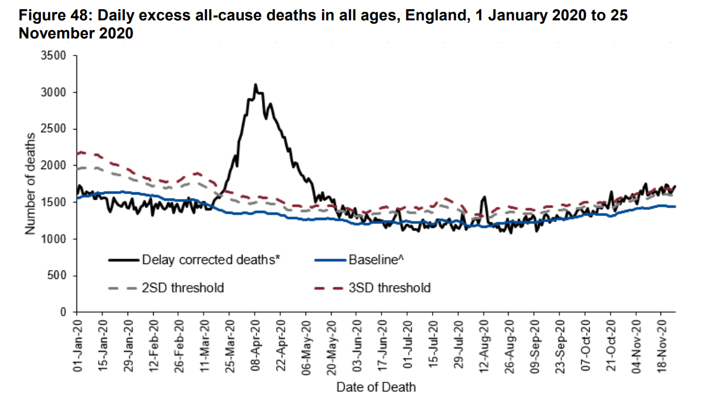
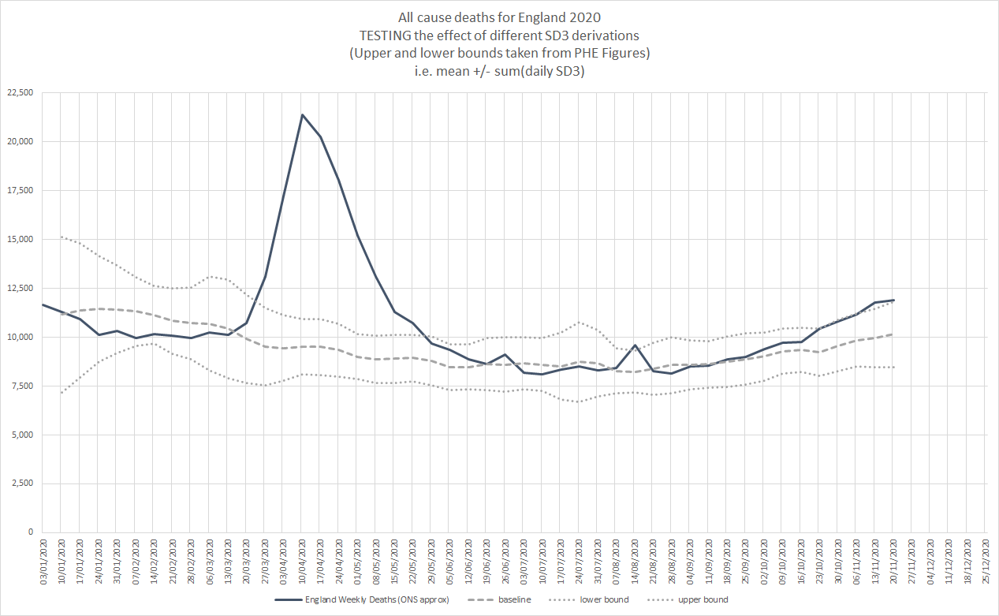
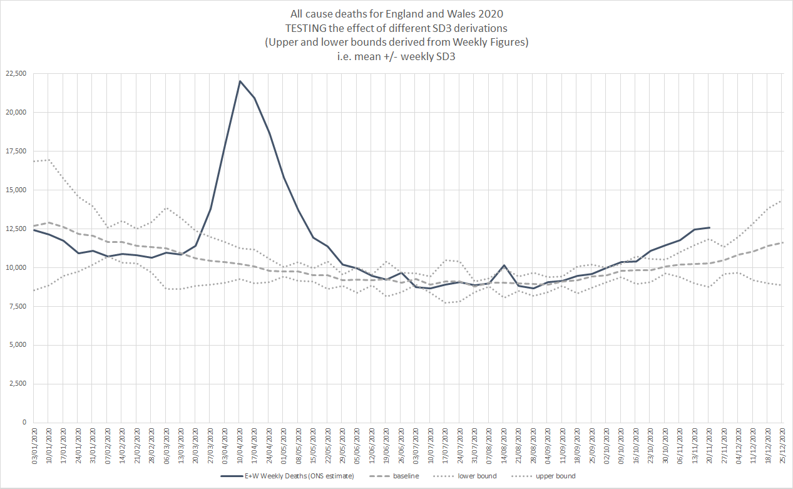

## Explanation of 3SD

### Intro

There is a really big issue with this chart which I will try to explain in the following thread.

In it's current state it should NOT be used as it is very misleading.

I will demonstrate how it was created and then explain what needs to be corrected.

### Part 1

The baseline and 3sd have been taken from the PHE National flu and COVID-19 surveillance reports.

The baseline and upper bound are DAILY figures in the PHE report.

7 days have been added together to create weekly values. This is plain WRONG... explained later

### Part 2

I have re-created some elements of the original graph to verify what has been done.

I have approximated England from the ONS data using E+W (occurrences) - W (registered)

The baseline, upper and lower bounds clearly match but there are slight differences in deaths.

p.s. The number of deaths is not the focus of this thread. I haven't tried to reverse-engineer the figures for England.

The main focus of this thread is the definition of upper / lower bounds which are very misleading.

### Part 3

Using daily ONS data for England + Wales, I have created a similar chart

The important thing is that daily 3sd values have been added together, like you did with PHE data.

This is INCORRECT when showing upper/lower bands for weekly data. It makes the weekly bands WIDER.

### Part 4

Using the same daily as above, I have created a second chart with accurate u/l bounds

The important thing is that the 3sd values are calculated from WEEKLY values.

The upper bound and lower bound are much closer together because weekly deaths are far lesss noisy.

### Summary

1) You can't add daily 3sd values from the PHE report and use them with weekly deaths. It is NOT a valid thing to do and is highly MISLEADING.

2) I didn't look closely but it is not clear how you have calculated deaths in England from the available ONS data. TOO LOW?

### Closure

I would suggest that you update your chart to use accurate upper / lower bounds and check your data for England.

It's not ready for the Daily Mail yet, unless you wish to mislead people.
