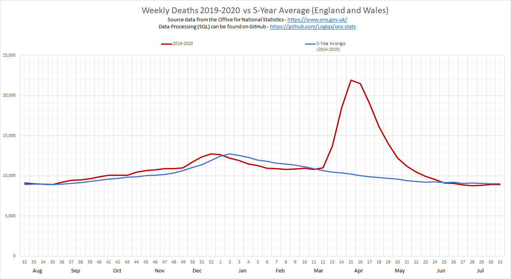
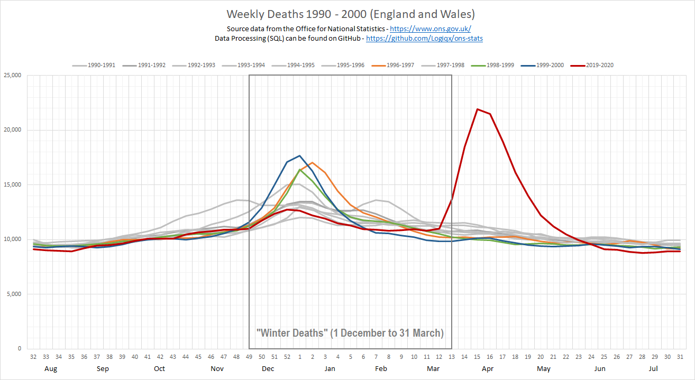
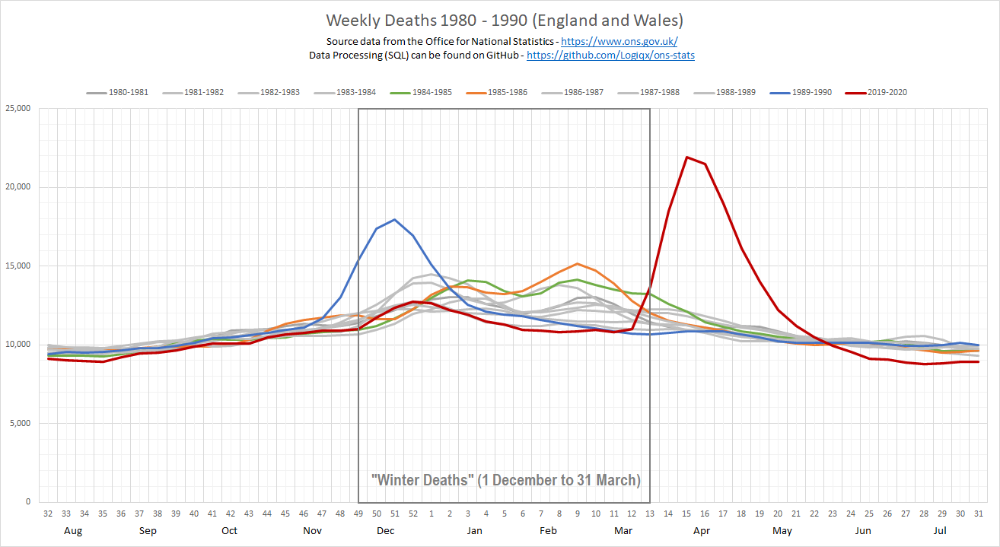
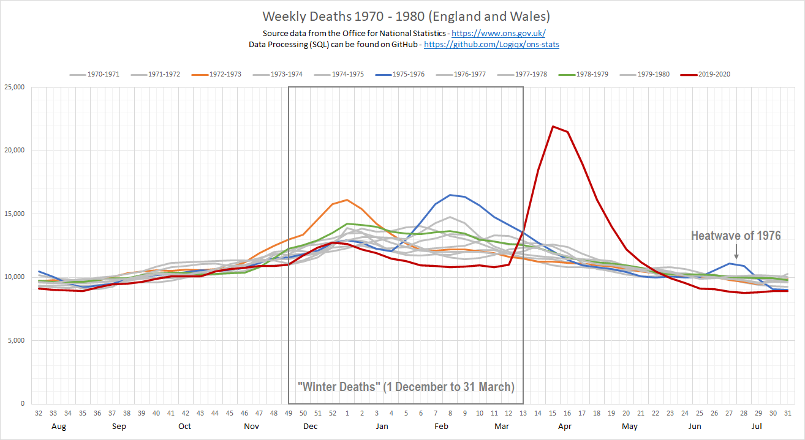

# ONS Statistics

## Analysis of Excess Deaths

Author: Michael George

Created: 12 May 2020

Updated: 30 July 2020

### Prologue

Since February 2020, COVID-19 has touched every country around the world and the health implications are becoming very clear. The pandemic has been accompanied by huge amounts of media attention, along with masses of statistics to digest. In some social circles, speculation is rife about the how much of a threat is posed by SARS-CoV-2 and the seriousness of COVID-19. In an attempt to make sense of the weekly death statistics from the Office for National Statistics ([ONS](https://www.ons.gov.uk/)) and put them into perspective, I have used my professional skills to produce a study which compares 2020 against each of the past five decades; 50 years.

There are many false claims being made on the internet, causing unnecessary confusion during this difficult time. This study uses the official data from the ONS and presents it in a way that is honest, open and intended to provide valuable insights. I start by explaining the concept of Excess Winter Deaths (EWD) and "excess deaths" so that these can be referred to throughout the article. The data and the code are on [GitHub](https://github.com/Logiqx/ons-stats) and therefore open to scrutiny as there is nothing to hide... no lies, no false claims, no political point scoring.

In addition to the analysis and a collection of easy to understand graphs, I discuss the likelihood of people having COVID-19 at the end of 2019 and how many people in the UK are still likely to be susceptible to SARS-CoV-2 and COVID-19. The conclusion section looks back over the past few months and the significance of the excess deaths / mortality in England and Wales. The final section "what next?" discusses the public health measures that are available in fighting the virus and what we can all do as individuals.

It's a relatively lengthy analysis for which I do apologise but it does show the pandemic in a light that I have yet to see in the mainstream media. A picture may be worth a thousand words but in this case it is useful to provide a thorough explanation as well.

### Background

Let me begin this article by stating that I am not an epidemiologist and that I'm a software engineer who has been something of a data geek for around 25 years. I worked in data warehousing and related reporting in the 90's, data engineering and analytics since the turn of the millennium and focused on data science projects in recent years.

Since mid-February, I have acquired something of an interest in the data and developments relating to SARS-CoV-2 (virus) and COVID-19 (disease) and I've done a fair bit of data exploration out of my own personal curiosity. Since several months worth of the pandemic are now included in the data published by the Office for National Statistics (e.g. weekly deaths in England and Wales), I have decided to do a write up of how 2020 compares to the past 50 years; 1970 onwards. This analysis follows on from an article that I wrote in late April - [COVID-19 - UK Trends and Observations](https://logiqx.github.io/covid-stats/).

I have written a separate [document](data_prep/README.md) explaining the ONS datasets, preparation and processing for this article. All of the ONS datasets and the project code can be found on [GitHub](https://github.com/Logiqx/ons-stats). The project code consists of [SQL](https://en.wikipedia.org/wiki/SQL), [Python](https://en.wikipedia.org/wiki/Python_(programming_language)) and [Excel](https://en.wikipedia.org/wiki/Microsoft_Excel).

### Excess Winter Mortality

It is well known that there are always more deaths amongst the elderly during the winter months than in the summer months. This happens every year and always shows some variation, depending on the severity of respiratory diseases and the prevalence of other common causes; circulatory diseases, dementia, Alzheimer’s disease, etc. These additional deaths during the colder months of the year are referred to as "Excess Winter Deaths" (EWD) or "Excess Winter Mortality" (EWM).

It is worth explaining how EWD are defined / calculated in the UK. The chart below shows the number of weekly deaths in England and Wales during the past twenty years. EWD are defined as the number of additional deaths during the 4 "winter" months (1 December to 31 March), over and above the average number of deaths during the 4 months immediately preceding and 4 months immediately following the "winter" months.

It can clearly be seen that the number of deaths between the months of April and November have not varied much over the past 20 years whereas the "winter" deaths show far more variation. March to June 2020 is clearly exceptional and corresponds to the peak in daily hospital admissions and daily deaths, directly and indirectly attributed to COVID-19.

Yearly EWD [bulletins](https://www.ons.gov.uk/peoplepopulationandcommunity/birthsdeathsandmarriages/deaths/bulletins/excesswintermortalityinenglandandwales/previousReleases) are published by the ONS every November and the chart below shows how the number of EWD has varied since 1970.

Note: I created the chart above from the exact number of daily deaths based on the date of occurrence and my EWD figures are identical to the official figures in the latest ONS [bulletin](https://www.ons.gov.uk/peoplepopulationandcommunity/birthsdeathsandmarriages/deaths/bulletins/excesswintermortalityinenglandandwales/2018to2019provisionaland2017to2018final).

Peaks in EWD are far from unusual and there have been about a dozen of them during the past 50 years. I have highlighted the most significant peaks since 1970 using red circles and all of these peaks are examined within this study, plus 2018/2019.

")

### Excess Deaths

In addition to "Excess Winter Deaths" which compare the monthly figures for December to March against the 4 months either side, it is common to report the number of "Excess Deaths", either weekly or monthly. Excess deaths are defined as the number of deaths over and above the 5-year average for that specific week / month of the year. The number of excess deaths in the UK and around the world has been widely reported by the media during the past few months. Excess deaths are the clearest measure of the human cost of a pandemic because they include the deaths directly attributable to the disease COVID-19 and the indirect deaths due to pressures on healthcare systems such as the NHS. The longer term effects are somewhat more complicated to measure but they will definitely be studied / analysed in the fullness of time.

The graph above shows the number of weekly deaths registered during 2019/2020 and it can be seen that up to Friday 13 March (week 11) the number of deaths being registered in England and Wales was consistent with the 5 year average. From April onwards the number of weekly deaths is expected to fall because the winter (including the "flu season") is over for another year. If you are wondering whether there is a precedent for such a large numbers of excess deaths outside of the winter months / flu season you will have that question answered by this report. This report will also compare what we have seen between March and June against all of the worst spikes in EWD over the past 50 years.

### Past Five Decades (1970-2020)

For each decade, I have plotted a graph containing every single year (mainly using grey lines) and coloured the "worst" years which are described in some detail. The figures for 2019/2020 (red line) have also been included in all of the charts for ease of comparison.

#### 2000-2020

Both decades have been plotted on a single graph due to their obvious similarities in weekly trends. It can be seen that there is little in the way of variation between the individual years from 2000 to 2019, especially during the months between April and November. Since the year 2000/2001 there haven't been any significant winter spikes but a consistently high number of weekly deaths during 2017/2018 (blue line) lead to [49,410](https://www.ons.gov.uk/peoplepopulationandcommunity/birthsdeathsandmarriages/deaths/bulletins/excesswintermortalityinenglandandwales/2018to2019provisionaland2017to2018final) EWD which was the highest recorded since 1975-1976. 34.7% of those EWD were caused by respiratory diseases and accounted for 17,400 of all EWD in 2017/2018. To quote the ONS report:

> Respiratory diseases remained the most prominent underlying cause of excess winter deaths (EWD) with 84.9% more respiratory deaths in the winter months compared with the non-winter months in 2017 to 2018. This equates to 17,400 EWD caused by respiratory diseases and accounted for 34.7% of all EWD.
>
> Of these excess respiratory deaths, pneumonia (specifically ICD-10 code J18) and chronic obstructive pulmonary diseases (specifically ICD-10 code J44) accounted for the largest proportions. The prominence of pneumonia is likely related to the relationship between EWM and a range of bacterial and viral respiratory pathogens including influenza.

Note: The 49,410 EWD of 2017/2018 were the worst in over 40 years but only 17,400 of those were due to respiratory diseases. When you hear claims that 50,000 people died of influenza in the winter of 2017/2018 it is simply incorrect. There are several respiratory diseases which lead to EWD and influenza is just one of those diseases; all respiratory diseases combined accounted for 17,400 deaths in 2017/2018.

The next worst winter between 2000 and 2020 was 2014/2015 (orange line) which had [43,720](https://www.ons.gov.uk/peoplepopulationandcommunity/birthsdeathsandmarriages/deaths/bulletins/excesswintermortalityinenglandandwales/201415provisionaland201314final) EWD. Respiratory diseases were recorded as the underlying cause of death for 36% of all EWD, with the majority of these deaths occurring in the 75 and over age group. Pneumonia (sometimes caused by the flu) was the underlying cause in 19% of all excess winter deaths in 2014/15; approximately 8,300 deaths.

**The year 2019/2020 had been consistent with the 5 year average and was typical of the past 20 years, until Friday 20 March (week 12) when there was a small but "unexpected" increase in the number of weekly deaths. Weeks 14 to 24 showed a large number of excess deaths, mainly due to COVID-19 but also due to indirect causes which have yet to be confirmed. Prior to COVID-19 it was looking like the winter period would have been close to the 5-year average of 30,000-35,000 EWD.**

**It is worth knowing that the average number of EWD between 2000 and 2019 is 28,400, although the actual number varies each year. The lowest number of EWD in this period was in 2013/2014 (17,280 EWD) and 2017/2018 was the highest in over 40 years (49,410 EWD). The EWD season for 2019/2020 was pretty much over when COVID-19 took off in the UK and the number of excess deaths between week 12 and week 24 (20 March to 12 June 2020) was a little over 61,000 for England and Wales.**

**These 61,000 excess deaths were mainly during April and May and are comparable to an additional two winters worth of excess deaths. You can either think of 2020 having 3 "average" winters worth (~30,000 x 3), 2 winters worth (30,000 + 60,000) or 1 giant winter (90,000) dwarfing the 58,000 of EWD of 1975/1976. The occurrence of so many excess deaths outside of the winter months has not occurred at any time during the past 50 years.**

Minor Notes:

- "Swine Flu" was prevalent in the UK during 2009 but there were [few deaths](https://www.nhs.uk/news/cancer/swine-flu-deaths-examined/) despite many people being very sick and hospitalised. SARS-CoV-2 and COVID-19 are much more serious than the swine flu of 2009 and have a much higher case fatality rate.
- The winter of 2018/2019 had relatively few EWD but it should be remembered that 2017/2018 was the worst in over 40 years. It is highly conceivable that the large number of EWD during 2017/2018 caused the number of deaths in 2018/2019 to be low, due to the exceptional number of people who had already died during 2017/2018.

#### 1990-2000

The 1990s are where historical comparisons start to become slightly more interesting. Several winter spikes can be seen during the 1990s but the number of EWD in 2017/2018 (discussed earlier) was still higher than any of the winters of the 1990s. It was estimated that just under [22,000](http://news.bbc.co.uk/1/hi/health/4358364.stm) people were killed by seasonal flu in the year 1999/2000 (blue line) when the EWD was [48,420](https://www.ons.gov.uk/peoplepopulationandcommunity/birthsdeathsandmarriages/deaths/bulletins/excesswintermortalityinenglandandwales/2018to2019provisionaland2017to2018final#excess-winter-mortality-in-england-and-wales). The incidence of acute bronchitis in the elderly during 1999/2000 was at record levels and coincided with seasonal flu which in itself was [not exceptional](https://www.ncbi.nlm.nih.gov/pmc/articles/PMC2870877/). It was also estimated that just under [21,400](http://news.bbc.co.uk/1/hi/health/4358364.stm) people were killed by flu in the year 1996/97 (orange line) when the EWD was [47,700](https://www.ons.gov.uk/peoplepopulationandcommunity/birthsdeathsandmarriages/deaths/bulletins/excesswintermortalityinenglandandwales/2018to2019provisionaland2017to2018final#excess-winter-mortality-in-england-and-wales).

It should be clear from these data that EWD are not solely due to the flu season, although people seem to consider them analogous.

When comparing the COVID-19 peak between April and May 2020 to the 1990s you should also consider that at no point during the last 50 years has any noticeable spike ever been observed in weekly deaths between August and November or April and July. The 2020 peak for the week ending Friday 10 April (week 15) was suppressed by the strict social distancing measures in the UK during our "lockdown". Without suppressing transmission of the virus during these months it is hard to see how the number of weekly deaths wouldn't have been significantly higher between April and June, quite possibly several times higher.

There is little room for doubt because of the basic principles within the [SIR](https://en.wikipedia.org/wiki/Compartmental_models_in_epidemiology) model (susceptible, infectious, or recovered) and the various elaborations that have underpinned epidemiology for almost a century. You can learn the very basics of epidemiology from a couple of short videos on YouTube; [TEDx](https://www.youtube.com/watch?v=GkLlqobr3PY) and [3Blue1Brown](https://www.youtube.com/watch?v=Kas0tIxDvrg). Another talk on [TEDxYouth](https://www.youtube.com/watch?v=eHlu6Vi_wxo) is also good for non-scientists / mathematicians.

#### 1980-1990

The 1989/90 winter period was the [worst since 1975/76](https://www.nytimes.com/1989/12/24/world/british-flu-epidemic-claims-lives-and-is-forcing-delays-in-surgery.html) and was the last [flu epidemic](https://www.theguardian.com/world/2000/jan/10/qanda.infectiousdiseases) to hit the UK. The epidemic began in late November (peaking in December) and it was estimated that 600 people per 1,000 fell ill, leading to [26,000](https://www.theguardian.com/world/2000/jan/10/qanda.infectiousdiseases) deaths. The total number of EWD in 1989/90 was [47,200](https://www.ons.gov.uk/peoplepopulationandcommunity/birthsdeathsandmarriages/deaths/bulletins/excesswintermortalityinenglandandwales/2018to2019provisionaland2017to2018final#excess-winter-mortality-in-england-and-wales) which was not dissimilar to other bad winters throughout the 1990s.

I've also highlighted 1985/86 (orange line) when the number of EWD was [49,330](https://www.ons.gov.uk/peoplepopulationandcommunity/birthsdeathsandmarriages/deaths/bulletins/excesswintermortalityinenglandandwales/2018to2019provisionaland2017to2018final#excess-winter-mortality-in-england-and-wales) and 1984/85 (green line) when the number of EWD was [47,380](https://www.ons.gov.uk/peoplepopulationandcommunity/birthsdeathsandmarriages/deaths/bulletins/excesswintermortalityinenglandandwales/2018to2019provisionaland2017to2018final#excess-winter-mortality-in-england-and-wales). It is worth noting that although the peak in 1985/86 (orange line) was less pronounced than 1989/90 (blue line) the total number of EWD was approximately 2,000 higher in 1985/86. This illustrates how excess deaths can be compressed into a shorter timeframe or spread out over a longer timeframe but still result in a similar total.  

Since the flu epidemic in 1989/1990 there have been yearly campaigns for widespread flu vaccinations which partly explains why we haven't seen any big spikes or large numbers of flu related deaths since the turn of the millennium. There is a growing concern that if we have a bad flu season at the same time as COVID it could be huge a challenge for the NHS. A widespread flu vaccination campaign is being planned for this winter to mitigate the risk to public health and the NHS.

#### 1970-1980

Throughout the 1970s there were substantial flu epidemics during most winters but subsequent decades have been somewhat less severe. It is sometimes said that doctors entering general practice after 1990 have not really experienced a "serious" influenza epidemic.

The number of EWD in 1975/76 was [58,100](https://www.ons.gov.uk/peoplepopulationandcommunity/birthsdeathsandmarriages/deaths/bulletins/excesswintermortalityinenglandandwales/2018to2019provisionaland2017to2018final#excess-winter-mortality-in-england-and-wales) (blue line) which is a record that has not been surpassed in almost 45 years. The dominant strain of influenza during 1975/1976 was a variant of A/Hong Kong/1/68 (AKA "Hong Kong Flu" of 1968/1969) from Australia, A/Victoria/3/75. It spread throughout the UK causing widespread outbreaks, peaking in February and was accompanied by a high mortality rate. Details of the Victoria strain from 1975/1976 can be found in a WHO bulletin of 1978 ([page 199](https://apps.who.int/iris/bitstream/handle/10665/261740/PMC2395576.pdf)) and the CDC influenza surveillance report ([summary](https://stacks.cdc.gov/view/cdc/287) section) because it was also prevalent in the USA. It's likely that over 30,000 of the EWD were due to this particular flu epidemic.

The number of EWD in 1978/79 was [48,490](https://www.ons.gov.uk/peoplepopulationandcommunity/birthsdeathsandmarriages/deaths/bulletins/excesswintermortalityinenglandandwales/2018to2019provisionaland2017to2018final#excess-winter-mortality-in-england-and-wales) (green line) and the number of EWD in 1972/73 was [46,630](https://www.ons.gov.uk/peoplepopulationandcommunity/birthsdeathsandmarriages/deaths/bulletins/excesswintermortalityinenglandandwales/2018to2019provisionaland2017to2018final#excess-winter-mortality-in-england-and-wales) (yellow line). These years are both comparable to the worst EWD figures in the 1980s and 1990s but significantly lower that 1975/76. The winters of 1972/73 (orange line) and 1978/79 (green line) also illustrate how excess deaths either can be compressed into a shorter time frame or spread out over a longer time frame. The year showing the highest peak does not necessarily correspond to the highest EWD.

As an aside, the [heatwave of 1976](https://en.wikipedia.org/wiki/1976_British_Isles_heat_wave) can also be seen in June/July and was thought to have caused 20% of the "excess deaths" that year. You may notice how small the heatwave looks on the graph above, yet it accounted for 20% of the excess deaths during a 12 month period.

### Excess Deaths

You may have heard (or read) that excess deaths are the most accurate way to assess the impact of COVID-19 in terms of overall mortality. In truth it may not possible to do a complete analysis of these deaths until almost a year from now (maybe even two or three years) but important observations can still be made for the months of March to June 2020.

The chart below compares the total number of weekly deaths for 2019-2020 against the 5 year average. The previous charts throughout this document also made it very clear that April to June 2020 have been far from "normal". Yes, people do die every year due to the flu but never in such large numbers and never in such a short period of time, not once during the past 50 years. Large numbers of excess deaths have not been seen during the "non-winter" period and such a big spike hasn't been seen during the "winter" months either.

Note: The peak in the week ending Friday 17 April (week 16) was very much suppressed due to strict social distancing measures and "lockdown" in the UK. Without suppressing the transmission of the virus the numbers of weekly deaths would have likely been several times higher during April, May and June. This is based on the fact that the majority of the UK population are still susceptible to SARS-CoV-2 + COVID-19 and will be discussed later in this article.

### Did you really have COVID-19?

I regularly see people who believe they had COVID-19 in late 2019, sometimes as early as October. However, if a significant number of people had COVID-19 in October then it is very hard to explain why there is no evidence of the same level of challenges in hospitals and morgues during late 2019 / early 2020. When SARS-CoV-2 arrived in the UK during [February and March](https://virological.org/t/preliminary-analysis-of-sars-cov-2-importation-establishment-of-uk-transmission-lineages/507) it quickly spread but there is no evidence of the same happening during late 2019 / early 2020 which would be expected if it were the same virus and disease.

Firstly, ICNARC official [reports](https://www.icnarc.org/Our-Audit/Audits/Cmp/Reports) of critical care units shows that between March and June 2020, COVID-19 admissions equate to over 5 years worth of flu / viral pneumonia patients. It reports 10,557 COVID-19 patients being admitted to ICU in just a few months, compared to 5,782 patients for flu + viral pneumonia over the last 3 years; 1 January 2017 to 31 December 2019. The most severe COVID-19 patients were initially thought to be suffering from viral pneumonia or acute respiratory distress syndrome ([ARDS](https://www.nhs.uk/conditions/acute-respiratory-distress-syndrome/)) but COVID-19 is now understood to be a much more complicated and serious disease. Around 10% of patients die in ICU after being admitted for the flu / viral pneumonia, compared to the 40-50% of the COVID-19 patients being admitted to ICU between March and June 2020.

Secondly, ONS [bulletins and datasets](https://www.ons.gov.uk/peoplepopulationandcommunity/birthsdeathsandmarriages/deaths/bulletins/deathsregisteredweeklyinenglandandwalesprovisional/latest) for weekly deaths don't show anything out of the ordinary between October and December 2019. This is clear from graphs in this article and on the ONS website which show the number of weekly excess deaths for 2019/2020.

Thirdly, a study of the SARS-CoV-2 genome from 20,000 people in the UK identified the origins as being mainly from Italy, Spain and France during [February and March](https://virological.org/t/preliminary-analysis-of-sars-cov-2-importation-establishment-of-uk-transmission-lineages/507) but showed no evidence of viral ancestors prior to that time.

Based on these three facts, I can only conclude that whatever was doing the rounds in late 2019 / early 2020 was not SARS-CoV-2 and people were not suffering from COVID-19. 

### How many people had COVID-19?

This really is the million dollar question as it helps to put all of the available statistics into context and to inform future policy decisions.

The people who got the most sick seem to have the most antibodies and the people who had mild symptoms (or were asymptomatic) seem to have fewer antibodies. It appears that the number of antibodies being detected may also reduce after a matter of months but they appear to be detectable for many months after someone is sick with COVID-19. For example, I have a friend who had COVID-19 relatively mildly in April and tested positive for antibodies in July.

A study in Sweden shows that some people without antibodies often show signs of COVID-19 infection and immunity; T-cells. The study shows that the number of people who may potentially have had COVID-19 mildly or asymptomatically may be approximately double what the antibody tests imply but this study is yet to be peer reviewed. A large [study](https://www.thelancet.com/journals/lancet/article/PIIS0140-6736%2820%2931483-5/fulltext) in Spain tested 52,000 people and indicates that around 5% of the population have antibodies so even if the T-cell study is correct that might only imply that up to 10% have had the disease, leaving over 90% still susceptible.

In the UK our antibody testing indicates that around [7%](https://www.ukbiobank.ac.uk/2020/07/uk-biobank-covid-19-antibody-study-latest-updates/) of the population have had COVID-19 and even if we factor in people with T-cell immunity it still implies that the vast majority of the population are still susceptible to SARS-CoV-2 and COVID-19. There is plenty more "fuel for the fire" and come the winter time when many diseases spread virulently it is unclear quite what will happen. Although younger people are less likely to die from COVID-19 they can still become very sick and end up in hospital. The recognition of "long COVID" is also cause for concern, potentially leaving some people who were fit and healthy with lifelong ailments such as [idiopathic pulmonary fibrosis](https://www.nhs.uk/conditions/idiopathic-pulmonary-fibrosis/).

### Conclusions

It can clearly be seen that the autumn and winter of 2019/20 closely matched the 5-year average and it is reasonable to have expected week 13 onwards (end of March) to have also followed the same 5-year average, given there has been little variation over the past 20 years. The 5-year average for EWD was 35,000 during the years 2014-2019 (28,000 for 2000-2019) and this year was on track to be in the same ballpark, right up until the arrival of SARS-CoV-2 and COVID-19. It is only reasonable to conclude that without COVID-19 we'd have seen a perfectly "normal" winter in 2019/20 which would have equated to around 30,000-35,000 EWD.

Note: As an aside, the calculation for EWD has produced useful insights for many decades but it will be somewhat "unsuitable" for 2019/2020. April to June 2020 will be the first time in at least 50 years where the average number of spring/summer deaths exceeds the number of "winter" deaths. This will make for a somewhat unusual EWD bulletin in November since 2019/2020 was perfectly normal until COVID-19 arrived and the usual EWD calculation won't reflect this due to the unprecedented figures between April and June 2020.

During the 6 weeks between week 12 (Friday 20th March 2020) and week 24 (Friday 24th June) there have been over 61,000 excess deaths registered in England and Wales, regardless of the underlying cause. This significant number of excess deaths is unprecedented during the past 50 years and it is tragic that so many people have sadly died before their time. These 61,000 excess deaths are in addition to the usual 30,000-35,000 EWD and is the broadly equivalent to two additional years worth of EWD during April and June. Many of these 61,000 excess deaths can be considered to be "early" deaths but it is not clear whether how early; e.g. months, years or potentially decades for some individuals.

The latest serology testing (antibody testing) indicates that around [7%](https://www.ukbiobank.ac.uk/2020/07/uk-biobank-covid-19-antibody-study-latest-updates/) of the UK population have been already infected by SARS-CoV-2 and suggests that without strict social distancing we'd have seen a much larger number of deaths between April and June. This all comes back to the ability of the virus to reproduce and it is widely recognised that the doubling time was around 3-4 days in March 2020. The consequence of continuing to live our lives as normal would have been the number of infections doubling every 3-4 days during the last week of March and onwards. That would have lead to many times more hospitalisations and subsequent deaths which would have been truly horrific. If there is insufficient hospital capacity then people will die unnecessarily due to COVID-19 and other diseases.

Every additional death caused by this pandemic is tragic but to put these numbers in perspective it is worth remembering that the early models of a "reasonable worst case scenario" suggested that [500,000](https://www.imperial.ac.uk/mrc-global-infectious-disease-analysis/covid-19/report-9-impact-of-npis-on-covid-19/) people could die in the UK, without taking any mitigating actions. If the 7% figure from serological testing is reliable then it is relatively straightforward to take the numbers that we already know (likely number of infections, number of hospitalisations, number of deaths, doubling time, R0, etc) and conclude that the 500,000 estimate was actually quite plausible. It is clear that strict social distancing / lockdown had a profound effect on the spread of the virus (reducing R0 from ~3.0 to ~0.7) and avoided a much higher peak of infections, hospitalisations and deaths between April and June.

### What Next?

We can think of COVID-19 as a fire that is still smouldering. The reason that many of the experts are concerned is that it does have the potential to start up again as has been demonstrated in a number of countries who have started to relax their public health measures. If the UK has a flair up even half the size of March to June and at the same time as regular winter illnesses (including seasonal flu) then the NHS is going to have a very tough time.

Since 13th May the UK has been slowly relaxing some of the restrictions. During this time the basic reproduction number (R0) has remained relatively constant and the number of new cases plateaued, although it is currently showing signs of increasing slowly. Suppression of the disease will largely be down to how the UK public behave and their ability to maintain social distancing. It is an extremely difficult balancing act trying to regain some semblance of normality in our lives whilst keeping the virus in check. The government has the unenviable task of balancing the immediate health risks to the public and the short/medium/long term risks to the economy, due to the two being inextricably linked. I certainly don't envy anyone having to make such difficult decisions.

Winter could potentially be a very challenging time for the NHS when you consider the vast majority of the UK population are still susceptible to SARS-CoV-2 and becoming sick with COVID-19. During the past few months, doctors and epidemiologists have learnt a great deal about SARS-CoV-2 and COVID-19 but also given them cause for concern. We can only hope that enough of the general public understand the threat of this disease and why they are being asked to make personal sacrifices. We all have a collective responsibility to suppress the transmission of the virus and protect the vulnerable amongst our friends, family and the wider community. We might think of ourselves as "safe" but the reality is that that nobody should take it lightly. You only need to listen to ICU doctors talking about their experiences to understand that COVID-19 is not to be underestimated.

Social distancing and contact tracing are currently the best line of defence against the spread of the virus. Realistically an efficacious vaccine is the best way out of this situation so let's just hope that widespread misinformation and a general lack of awareness (or trust of governments and pharmaceutical companies) do not hinder these initiatives. COVID-19 is going to be with us for some time to come and we have to keep it under control throughout the coming winter. Hang in there and please do the right thing for yourself, family, friends and the wider community.

Please share if you feel that more people would benefit from this information. We're all in this pandemic together!

<!-- Global site tag (gtag.js) - Google Analytics -->

