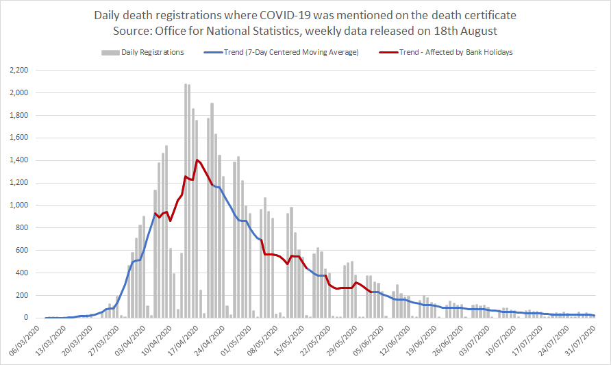
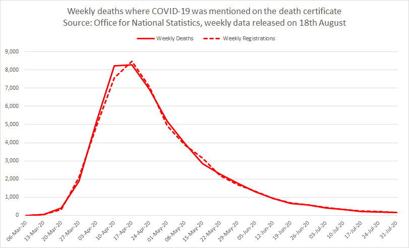
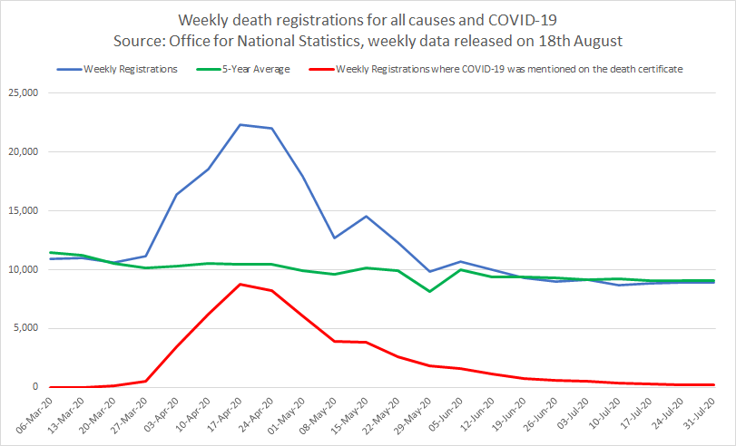
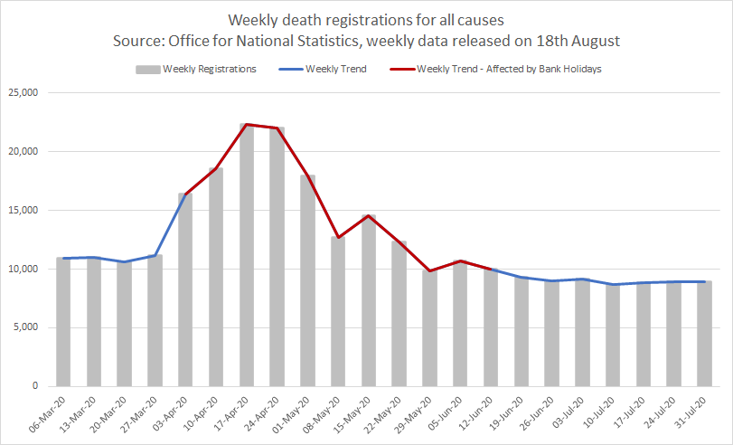
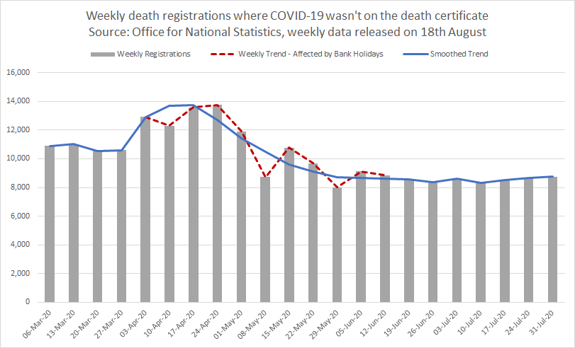
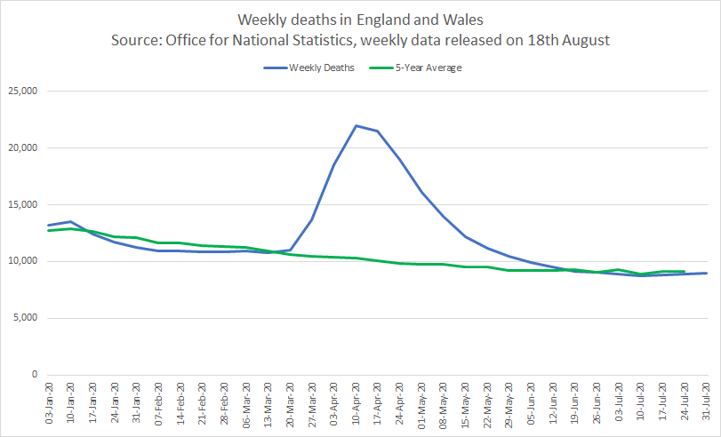

# ONS Statistics

## Analysis of Excess Deaths

Author: Michael George

Date Created: 12 May 2020

Project Code: https://github.com/Logiqx/ons-stats

### Overview

Daily deaths between Jan 1970 to July 2019 were download from the ONS website and are based on the date of occurrence. The daily deaths between Jan 1970 to July 2019 were rolled up into weekly, monthly and quadrimester periods using [SQL](https://en.wikipedia.org/wiki/SQL) and [MariaDB](https://en.wikipedia.org/wiki/MariaDB).

Weekly death registrations for Aug 2019 and Jul 2020 were extracted from the weekly ONS [datasets](https://www.ons.gov.uk/peoplepopulationandcommunity/birthsdeathsandmarriages/deaths/datasets/weeklyprovisionalfiguresondeathsregisteredinenglandandwales). All of the weekly data was combined in Excel to accurately reflect when deaths actually occurred during 2020.

TODO - mention delays and bank holidays and the need to clean up the data, factoring in registration delays (median of 5 days) and bank holidays.

### Date of Registration vs Date of Occurrence

All of the daily data for Jan 1970 to Jul 2019 is based on the date of occurrence. When the daily data is converted into weekly periods and shown graphically it results in a smooth plot showing how many people died each week; see below for 2014/2015 and 2017/2018.

The weekly data from the ONS for Aug 2019 to Jul 2020 is based on the date of registration. When the weekly registration data is shown graphically it shows significant fluctuations, especially during and after the weeks that contain a bank holiday. This can clearly be illustrated by comparing registrations and occurrences for the historical data; see below for 2014/2015 and 2017/2018.

The data and graphs shown below can be found in the spreadsheet "ons_weekly_deaths.xlsx" which is in the project "data" folder.

**2014/2015**

The effect of bank holidays can clearly be seen as a sudden drop followed by a spike in the weekly registrations.

**2017/2018**

In addition to the bank holidays there is also an unexpected dip in week 9 of 2018. The dip is made up for during weeks 10 and 11.

### Daily COVID-19 Deaths

**Daily death occurrences where COVID-19 was mentioned on the death certificate**

TODO - background and why expect a smooth distribution.

This data is pretty clean distribution, especially when shown as a 7-day trend using a [centred moving average](https://en.wikipedia.org/wiki/Moving_average#Simple_moving_average).

**Daily death registrations where COVID-19 was mentioned on the death certificate**

TODO - background on days that registrations take place.

The registration data is pretty messy although it is slightly better when shown as a 7-day trend; centralised moving average.

The effect of bank holidays on the timeliness of death registrations is highlighted in red.

### Weekly COVID-19 Deaths

**Date of Registration vs Date of Occurrence**

TODO - explain the data available

**Accounting for Registration Delays**

TODO - Explain how the median is 5 days and it can be proved using the daily COVID data. Explain approach to shift weekly data and how I determined the parameters using a Python script; 2017 and 2018. How I used RMS error as the measure. Applying the 2017/2018 parameters to the weekly COVID data from 2020 resulted in the following graph, giving good cause to trust the shift parameters; 48% / 52%.

Latest ONS report - [Impact of registration delays on mortality statistics in England and Wales: 2018](https://www.ons.gov.uk/peoplepopulationandcommunity/birthsdeathsandmarriages/deaths/articles/impactofregistrationdelaysonmortalitystatisticsinenglandandwales/2018) (published 7 Feb 2020)

ONS data for 2017 / 2018 - [Daily deaths, England and Wales, 2015 to 2018 occurrences](https://www.ons.gov.uk/peoplepopulationandcommunity/birthsdeathsandmarriages/deaths/adhocs/11178dailydeathsenglandandwales2015to2018occurrences)

### Processing

TODO - explain this graph; exact numbers for COVID (red) are known. There is a need to clean up the all-cause data (blue).

TODO - Taking the same data to highlight where bank holidays have an impact...

#### Step 1

TODO - Remove COVID registrations. This is very simple and as detailed data for COVID is provided by the ONS.

#### Step 2

TODO - Adjust the non-COVID registrations to account for the bank holidays. Totals are unchanged and the peak is unchanged.

#### Step 3

TODO - Account for registration delays. Parameters were derived by a Python script, analysing 2017 and 2018. Used RMS error as the measure. 48% / 52%.

#### Step 4

TODO - Re-introduce the COVID deaths to produce total weekly deaths; all causes (blue).

Notice how the peaks are aligned (w/e Friday 10th April) which corresponds to the daily peak on Wed 8th April.

### Review

**Comparison with Weekly Registrations**

TODO - explain that COVID (red) is actual data and the blue is derived by the 4 step process described earlier.

Note that the total number of deaths is unchanged and the peak is actually slightly lower.

**Comparison with Daily Deaths**

TODO - Show the whole of 2020 relative to the 5-year average.

TODO - explain the PHE data and how it accounts for registration delays.

Surveillance reports https://www.gov.uk/government/publications/national-covid-19-surveillance-reports

TODO - I'm very happy with the end result of the data clean up.

### Appendix - Data Sources

#### Daily death occurrences, England and Wales: 1970 to 2018

Summary: ONS datasets were used to produce "daily_deaths_1970-2018.csv" and they were loaded into MariaDB using SQL.

**Data for Jan 1970 - Dec 2014**

Downloaded the spreadsheet associated with request [005549](https://www.ons.gov.uk/peoplepopulationandcommunity/birthsdeathsandmarriages/deaths/adhocs/005459dailydeathoccurrencesenglandregionsofenglandandwales1970to2014) - "Daily death occurrences, 1970-2014.xlsx".

The data came from the worksheet named "National daily deaths". The year + month + day were converted to yyyy-mm-dd.

**Data for Jan 2015 - Dec 2018**

Downloaded the spreadsheet associated with request [11178](https://www.ons.gov.uk/peoplepopulationandcommunity/birthsdeathsandmarriages/deaths/adhocs/11178dailydeathsenglandandwales2015to2018occurrences) - "dailydeathsfinal.xlsx".

The data came from the worksheet named "Table". The year + month + day were converted to yyyy-mm-dd.

**SQL Scripts**

The scripts "create_daily_deaths.sql" and "insert_daily_deaths_1970-2018.sql" were used to load the CSV into MariaDB.

#### Daily death occurrences, England and Wales (provisional): 2019

The dataset accompanying the Excess Winter Mortality publication was used to produce "daily_deaths_provisional_2019.csv".

**Data for Jan 2019 - Jul 2019**

Downloaded the spreadsheet associated with [Excess winter mortality in England and Wales](https://www.ons.gov.uk/peoplepopulationandcommunity/birthsdeathsandmarriages/deaths/datasets/excesswintermortalityinenglandandwalesreferencetables) (2018-2019) - "referencetable.xls".

The data in the worksheets named "3a" (England) and "3b" (Wales) was combined and saved as a CSV.

**SQL Script**

The script "insert_daily_deaths_provisional_2019.sql" was used to load the CSV into MariaDB.

#### Deaths registered weekly in England and Wales, provisional: 2019

**Data for Aug 2019 - Dec 2019**

Downloaded the latest spreadsheet for 2019 from [Deaths registered weekly in England and Wales, provisional: 2019](https://www.ons.gov.uk/peoplepopulationandcommunity/birthsdeathsandmarriages/deaths/datasets/weeklyprovisionalfiguresondeathsregisteredinenglandandwales/2019) - "publishedweek522019.xls".

#### Deaths registered weekly in England and Wales, provisional: 2020

**Data for Jan 2020 - Jul 2020**

Downloaded the latest spreadsheet for 2020 from [Deaths registered weekly in England and Wales, provisional: 2020](https://www.ons.gov.uk/peoplepopulationandcommunity/birthsdeathsandmarriages/deaths/datasets/weeklyprovisionalfiguresondeathsregisteredinenglandandwales/2020) - "publishedweek282020.xlsx".

