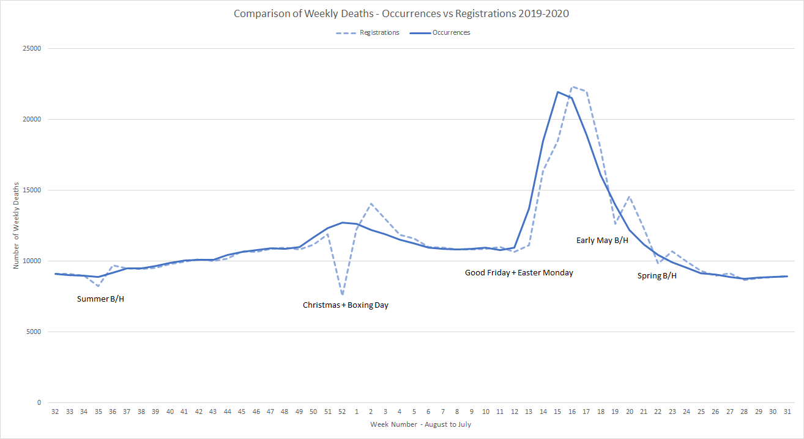
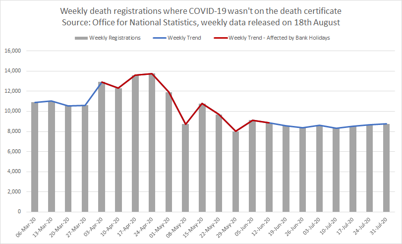
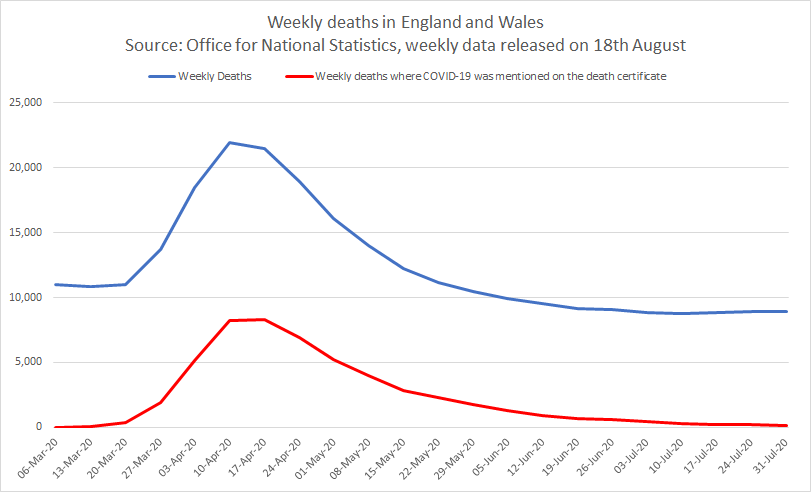

# ONS Statistics

## Analysis of Excess Deaths

Author: Michael George

Created: 12 May 2020

GitHub: https://github.com/Logiqx/ons-stats

### Overview

This study was mainly created from the number of daily deaths recorded by the ONS over the past 50 years; January 1970 to December 2018. Provisional daily figures for January 2019 to July 2019 were taken from the Excess Winter Deaths report published by the ONS in November 2019. The weekly figures for August 2019 onwards are taken from the weekly death registrations as published by the ONS. 

- Daily deaths between Jan 1970 to July 2019 were download from the ONS website and are based on the date of occurrence. The daily deaths between Jan 1970 to July 2019 were rolled up into weekly, monthly and quadrimester periods using [SQL](https://en.wikipedia.org/wiki/SQL) and [MariaDB](https://en.wikipedia.org/wiki/MariaDB).

- Weekly death registrations for Aug 2019 and Jul 2020 were extracted from the weekly ONS [datasets](https://www.ons.gov.uk/peoplepopulationandcommunity/birthsdeathsandmarriages/deaths/datasets/weeklyprovisionalfiguresondeathsregisteredinenglandandwales). All of the weekly data was combined in Excel to accurately reflect when deaths actually occurred during 2020.

Weekly registrations are subject to delays, especially around bank holidays. This mandates the need to clean up the registration data so that it can be compared to the historical data, factoring in registration delays (median of 5 days) and bank holidays.

Note: On average it usually takes around 5 days for a death to be registered in England and Wales with 74% of all deaths being registered within 7 calendar days during 2017/2018, according to the latest [analysis](https://www.ons.gov.uk/peoplepopulationandcommunity/birthsdeathsandmarriages/deaths/articles/impactofregistrationdelaysonmortalitystatisticsinenglandandwales/2018) by the ONS.

### 2019/2020

TLDR; I have created a process that converts the 2019/2020 weekly registration data into something that accurately represents the weekly occurrences. This document explains the process in detail and why it can be regarded as an accurate representation of weekly deaths during 2020.

### Date of Registration vs Date of Occurrence

All of the historical data (January 1970 to July 2019) is based on the date of occurrence. When the daily data is converted into weekly periods and shown graphically it results in a smooth plot showing how many people died each week.

The weekly registration data from the ONS for Aug 2019 to Jul 2020 is based on the date of registration. When the registration data is shown graphically it shows significant weekly fluctuations, especially during and after the weeks that contain a bank holiday. This can clearly be illustrated by comparing the registrations and occurrences for the past years; see below for 2014/2015 and 2017/2018.

The data and graphs shown below can be found in the spreadsheet "ons_weekly_deaths.xlsx" which is in the project "data" folder.

**2014/2015**

The effect of bank holidays can clearly be seen as a sudden drop followed by a spike in the weekly registrations.

**2017/2018**

In addition to the bank holidays there is also an unexpected dip in week 9 of 2018. This unexpected dip is made up for during weeks 10 and 11.

### Daily COVID-19 Deaths

**Daily death occurrences where COVID-19 was mentioned on the death certificate**

The daily occurrence data is a relatively clean distribution, especially when shown as a 7-day trend using a [centred moving average](https://en.wikipedia.org/wiki/Moving_average#Simple_moving_average).

**Daily death registrations where COVID-19 was mentioned on the death certificate**

Death registrations typically occur Monday to Friday but during the Easter period, registry offices also stayed open on the Saturday to try to minimise the impact of registration delays.

The daily registration data looks pretty messy, although it is slightly improved when shown as a 7-day trend using a centralised moving average. The effect of bank holidays on the timeliness of COVID-19 related death registrations is highlighted in dark red.

### Weekly COVID-19 Deaths

**Date of Registration vs Date of Occurrence**

In addition to the all-cause weekly data the ONS are publishing the COVID-19 data based on the date of registration and the date of occurrence. When shown together it is possible to see the effect of both generic registration delays and bank holidays.

**Accounting for Registration Delays**

The median time for registration is [5 days](https://www.ons.gov.uk/peoplepopulationandcommunity/birthsdeathsandmarriages/deaths/articles/impactofregistrationdelaysonmortalitystatisticsinenglandandwales/2018) and it can be proven using the daily COVID-19 data.

To account for delays in the weekly registration data, I have used a simple process which takes a certain percentage of deaths from the current week and another percentage from the following week. I determined the optimal parameters using a Python script using the historical data from [2017 and 2018](https://www.ons.gov.uk/peoplepopulationandcommunity/birthsdeathsandmarriages/deaths/adhocs/11178dailydeathsenglandandwales2015to2018occurrences).

The Python script calculates the root-mean-square deviation ([RMSD](https://en.wikipedia.org/wiki/Root-mean-square_deviation)) to determine the optimal parameters for 2017/2018; 48% and 52%.

Applying the 2017/2018 parameters to the weekly COVID-19 data from 2020 results in the graph below, giving good cause to trust the 2017/2018 parameters; 48% and 52%.

### Processing 2019/2020

Should you wish to look more closely the processing can be found in the spreadsheet "ons_weekly_deaths_2020.xlsx" on GitHub.

The graph below shows the weekly registration data for all causes (blue) and where COVID-19 appears on the certificate (red).

As has already been mentioned earlier, exact numbers for the COVID-19 related deaths are known and this process is mainly to determine an accurate representation of all cause mortality (blue).

Showing the same data in a slightly different form it is possible to highlight where bank holidays have a significant impact.

#### Step 1

The first step is to remove the COVID-19 registrations. This is very simple as the number of weekly COVID-19 registrations is provided by the ONS. This leaves the weekly registrations where COVID-19 was not implicated in the deaths.

#### Step 2

The non-COVID registrations are adjusted / smoothed to account for the additional bank holiday delays.

It is important to note that the total number of deaths remains unchanged and the peak also remains unchanged.

Essentially, some deaths are brought forward where the registration was delayed due to a bank holiday.

#### Step 3

The next step is a simple shift using the parameters that were determined by the Python script using data from 2017 and 2018. The Python used RMSD as the measure of "best fit" which turned out to be 48% / 52%. An illustration of the suitability of these parameters for 2020 data can be found earlier in this document, showing the deaths where COVID-19 was implicated.

The graph below shows the deaths where COVID-19 was not implicated, after accounting for registration delays.

#### Step 4

The final step is to re-introduce the COVID deaths based on date of occurrence, resulting in the total number weekly deaths for all causes (shown in blue).

The red line is original ONS data without any pre-processing. Notice how the peaks for these two distributions are still aligned (w/e Friday 10th April) and correspond to the daily peak on COVID-19 implicated deaths which was Wed 8th April.

### Review

**Comparison with Weekly Registrations**

The graph below shows the "before" and "after" for weekly death registrations; all cause mortality.

The solid blue line is the result of the processing described within this document whereas the solid red line is original ONS data.

Note that the total number of deaths is unchanged and the overall peak is actually slightly lower after the clean up.

**Comparison with Daily Death Registrations**

The graph below the output of this processing, relative to the 5-year average.

It is useful to compare my results against a graph that appears in the weekly COVID-19 [surveillance report](https://www.gov.uk/government/publications/national-covid-19-surveillance-reports) from Public Health England (PHE). They receive daily registration data from the General Register Office (GRO) and adjust it to allow for registration delays using historical data. I would expect the PHE daily data to follow a similar trend to the weekly data.

It is easy to visually compare my weekly data (above the green line) with the PHE daily data (above the blue line) to see that they are very similar. The fact that they are so similar gives my confidence that the process described in this document has worked well.

### Summary

I'm very happy with the end result of this processing as it allows me to show an accurate representation of weekly deaths (based on date of occurrence) which can be compared to historical data in my [study](../README.md) of excess deaths over the past 50 years.

The main spreadsheet for the study of excess deaths is "ons_weekly_deaths.xlsx" and it can be found on GitHub.

Aside from this processing the rest of the data preparation is relatively straightforward and was completed using [SQL](https://en.wikipedia.org/wiki/SQL).

### Appendix - Data Sources

#### Daily death occurrences, England and Wales: 1970 to 2018

Summary: ONS datasets were used to produce "daily_deaths_1970-2018.csv" and they were loaded into MariaDB using SQL.

**Data for Jan 1970 - Dec 2014**

Downloaded the spreadsheet associated with request [005549](https://www.ons.gov.uk/peoplepopulationandcommunity/birthsdeathsandmarriages/deaths/adhocs/005459dailydeathoccurrencesenglandregionsofenglandandwales1970to2014) - "Daily death occurrences, 1970-2014.xlsx".

The data came from the worksheet named "National daily deaths". The year + month + day were converted to yyyy-mm-dd.

**Data for Jan 2015 - Dec 2018**

Downloaded the spreadsheet associated with request [11178](https://www.ons.gov.uk/peoplepopulationandcommunity/birthsdeathsandmarriages/deaths/adhocs/11178dailydeathsenglandandwales2015to2018occurrences) - "dailydeathsfinal.xlsx".

The data came from the worksheet named "Table". The year + month + day were converted to yyyy-mm-dd.

**SQL Scripts**

The scripts "create_daily_deaths.sql" and "insert_daily_deaths_1970-2018.sql" were used to load the CSV into MariaDB.

#### Daily death occurrences, England and Wales (provisional): 2019

The dataset accompanying the Excess Winter Mortality publication was used to produce "daily_deaths_provisional_2019.csv".

**Data for Jan 2019 - Jul 2019**

Downloaded the spreadsheet associated with [Excess winter mortality in England and Wales](https://www.ons.gov.uk/peoplepopulationandcommunity/birthsdeathsandmarriages/deaths/datasets/excesswintermortalityinenglandandwalesreferencetables) (2018-2019) - "referencetable.xls".

The data in the worksheets named "3a" (England) and "3b" (Wales) was combined and saved as a CSV.

**SQL Script**

The script "insert_daily_deaths_provisional_2019.sql" was used to load the CSV into MariaDB.

#### Deaths registered weekly in England and Wales, provisional: 2019

**Data for Aug 2019 - Dec 2019**

Downloaded the latest spreadsheet for 2019 from [Deaths registered weekly in England and Wales, provisional: 2019](https://www.ons.gov.uk/peoplepopulationandcommunity/birthsdeathsandmarriages/deaths/datasets/weeklyprovisionalfiguresondeathsregisteredinenglandandwales/2019) - "publishedweek522019.xls".

#### Deaths registered weekly in England and Wales, provisional: 2020

**Data for Jan 2020 - Jul 2020**

Downloaded the latest spreadsheet for 2020 from [Deaths registered weekly in England and Wales, provisional: 2020](https://www.ons.gov.uk/peoplepopulationandcommunity/birthsdeathsandmarriages/deaths/datasets/weeklyprovisionalfiguresondeathsregisteredinenglandandwales/2020) - "publishedweek282020.xlsx".

