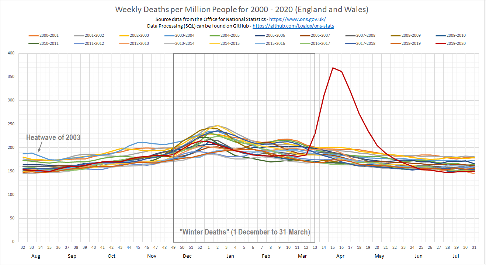
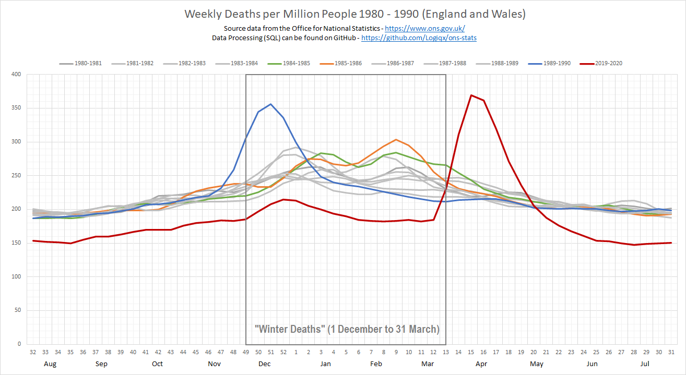
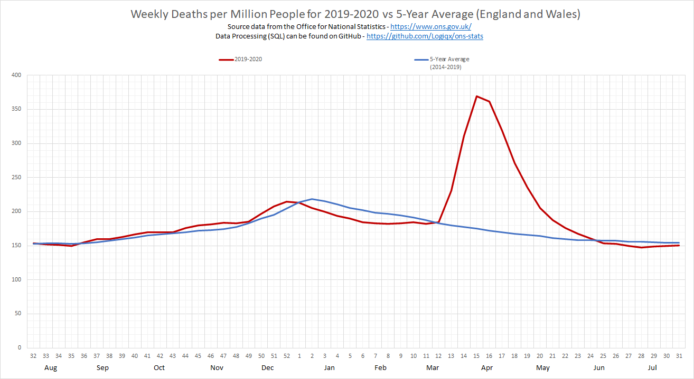

# ONS Statistics

## Analysis of Excess Deaths

Author: Michael George

Created: 12 May 2020

Updated: 30 July 2020

### Addendum

Should anyone be curious, I've also created some additional graphs to show the same weekly data based on the population size at the beginning of each reporting period.

These graphs have been created to complement the ones in the main analysis and are by no means a replacement, since the absolute numbers of weekly deaths are what the ONS use for historical comparisons.

I will not add much in the way of text since the original [analysis](../README.md) describes each of the decades in plenty of detail. If you want to "fact check" any historical figures then simply look at the main article for the absolute numbers and the context.

### Excess Winter Mortality

The graph showing 2020 in the context of other recent years remains largely unchanged and emphasises the occurrence of excess winters deaths (EWD) between 1 December and 31 March.

Occasionally the winter season will start slightly early as can be seen in 2003/2004 (light blue) where October saw an increase in the number of weekly deaths.

### Past Five Decades (1970-2020)

All data have been plotted according to the population size of England and Wales at the start of the reporting year, using the latest population data from the ONS.

#### 2000-2020

The years 2000-2020 saw little in the way of varying trends with the obvious exception of April and May 2020.

The reporting year from August 2019 to July 2020 was typical of the last 5 to 10 years, prior to the spike in April and May 2020. 

#### 1990-2000

There are a few points of note in the graph below.

- August 2019 to March 2020 shows how the percentage of the population that die each week has reduced when compared to the 1990s. This has been a gradual process that can be observed over the past 50 years.
- Despite the trend for fewer weekly deaths in recent years, April and May of 2020 were still more severe than even the worst winters of the 1990s. It should also be emphasised that April and May are not "winter" months and the 2020 peak was supressed.
- Aside from a steady increase in the number of weekly deaths during October and November 1993, large numbers of excess deaths were not observed during the 1990s, outside of the "winter" months.

#### 1980-1990

There are a few points of note in the graph below.

- August 2019 to March 2020 shows how the percentage of the population that die each week has reduced significantly when compared to the 1980s.
- Despite the trend for a lower number of weekly deaths in recent years, April and May of 2020 were more severe than even the worst winters in the 1980s. It should also be emphasised that April and May are not "winter" months and the 2020 peak was supressed.
- Aside from a steady increase in the number of weekly deaths during November 1989 (blue, reported in the main article), large numbers of excess deaths were not observed during the 1980s, outside of the "winter" months.

#### 1970-1980

There are a few points of note in the graph below.

- August 2019 to March 2020 shows how the percentage of the population that die each week has reduced significantly when compared to the 1970s, especially during the "winter" period.
- Despite the trend for a lower number of weekly deaths in recent years, April and May of 2020 were more severe than even the worst winters in the 1970s. It should also be emphasised that April and May are not "winter" months and the 2020 peak was supressed.
- Aside from a slight increase in the number of weekly deaths during November 1972 (orange, reported in the main article), large numbers of excess deaths were not observed during the 1970s, outside of the "winter" months.

### Excess Deaths

The graph that shows the number of "excess deaths" during 2019/2020 remains largely unchanged by the adjustment for population size. It is still completely unprecedented to see such large numbers of excess deaths outside of the "winter" months. 

It is important to recognise that unlike any other pandemics (or epidemics) in modern history, SARS-CoV-2 and the disease COVID-19 have not been allowed to run their natural course. The large number of excess deaths between April and May 2020 was kept artificially low due to the strict social distancing measures implemented across the UK, reducing the rate of transmission of the virus.

The scientific consensus is that the majority of the UK population are still susceptible to SARS-CoV-2 and the virus is still circulating within the community, albeit at a low but steady rate. Whilst there are a number of respected academics who believe the disease will just "burn itself out" due to a higher level of immunity than is suggested through serological testing and other studies, they hold a minority opinion amongst the experts in their fields.

Personally, I maintain an open mind and follow a number of the prominent sceptics but I still find the majority view more convincing.

### Wrap Up

It is easy to become complacent about the situation or form an opinion based on a superficial understanding of a very complex topic. Please be considerate and act responsibly in these months leading up to the winter. If you think you know better than the majority of the scientific and medical community, remember that your own actions and those whom you influence could be lead to great suffering.

Recent outbreaks around the world strongly suggest that the virus and COVID-19 do not just "go away" through wishful thinking. Are you really so sure that you know better than the majority of the experts? You might end up regretting your own actions and those whom you influence in the not so distant future.

Just remember that if you have alternative views and people challenge your "facts" or opinions they do so because they care for you and the community at large. Please be respectful; look after yourself, family, friends and the community by reducing the rate of transmission.

The facts strongly suggest that COVID-19 isn't going away any time soon and March to June were a stark warning for us all. Everything that we saw in those months were at a time when the NHS was not stretched and this winter could be very challenging for everyone.

Stay safe!

<!-- Global site tag (gtag.js) - Google Analytics -->

